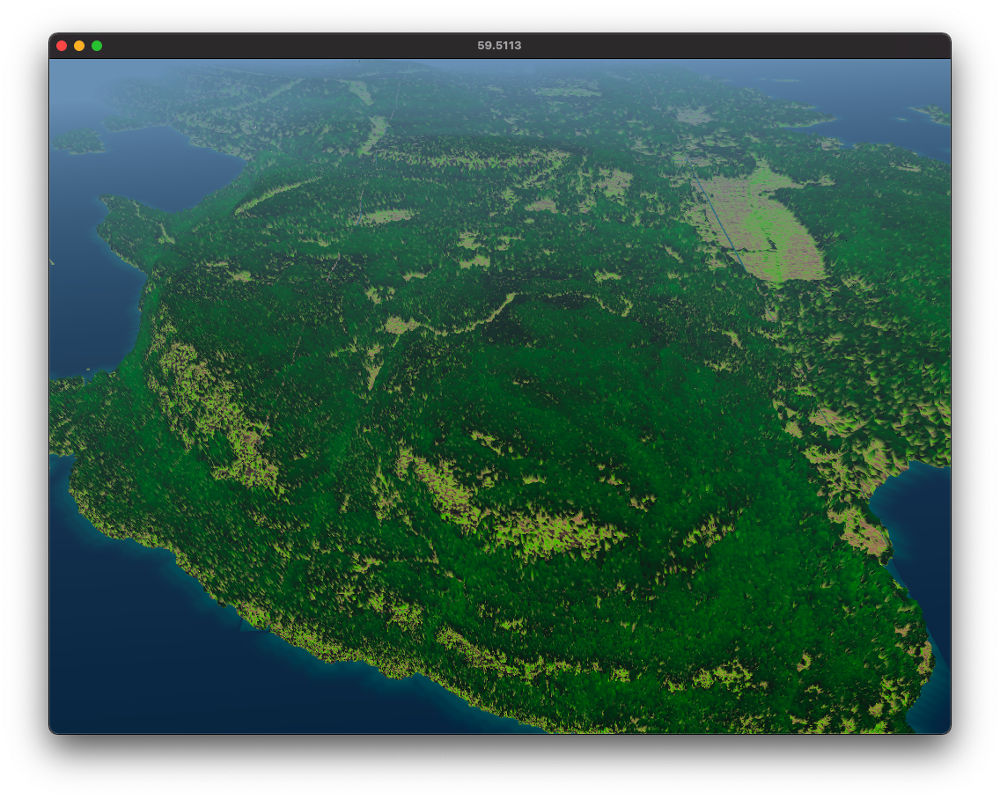

# galiano-lidar-render

Semi-realistic rendering of LiDAR data from https://lidar.gov.bc.ca/ of Galiano Island, BC, Canada. The project is done in 2 days at [Gradient Retreat](https://www.gradientretreat.com/) on the island in July 2024.

Data processing is done in C and python, and rendering is done with openFrameworks. The conversion of the coordinate system to lat/long and cartesian was by Erik Strand (https://github.com/erikstrand/galiano).

A screenshot:



A video:

<video src="screenshots/vid.mp4"></video>

## Features

- Separate "ground" and "vegetation" meshes derived from point cloud data.
- Trivial meshing algorithm by first aligning points to a grid.
- "Holes" on the ground patched with a Gaussian kernel.
- Level of detail system that loads different meshes based on distance.
- Colors using vertex colors, calculated based on lighting, vegetation height, and distance to coast.
- Camera movement.

## Usage

To prepare the dataset,

```sh
cd proc
mkdir -p dl
mkdir -p data
mkdir -p output
```

To download the LiDAR data:

```sh
python download.py > download.sh
sh download.sh
```

Clone Erik's [repo](https://github.com/erikstrand/galiano), and modify `runconvert.sh` to point to its path correctly.

Add the following line to the end of `laz_to_xyz.py`:

```python
np.savez(output.replace('_xyz','_lat'), points=lon_lat_points)
```

Then run

```python
python run.py
```

When the data processing is done, copy the content of `output/` folder to the `bin/data/` folder of the openFrameworks app.

Now run the openFrameworks app.